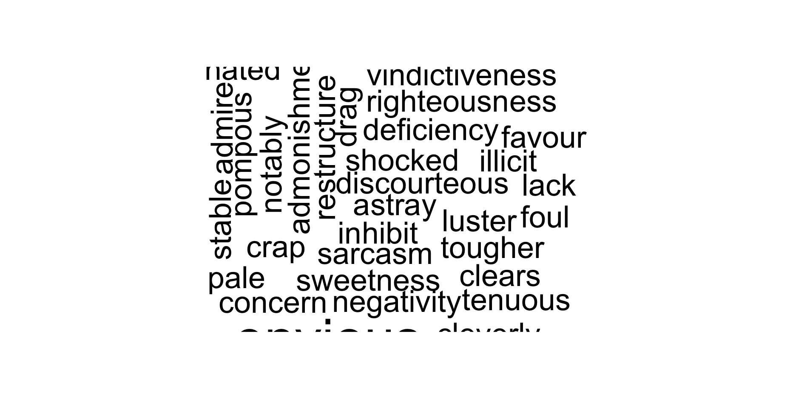

# DATA-332-Sentiment-analysis  
# Top 10 companies with positive sentiment  
## This graph shows the top ten companies that are perceived positively based on some sentiment analysis
  

# Top 10 companies with negative sentiment   
## This graph identify and rank the top ten companies based on the prevalence of negative sentiment in customer complaints   
  

# Sentiment Contribution Analysis  
## This graph shows the reason for visit based on the city the patients are in  
  

# Wordclouds   
## This image shows the most common words in the company complaints data 
  

